<div align="center">

  

</div>

<div align="center">

  <a href="https://git.io/typing-svg">
    
  </a>

</div>

<br/>

<div align="center">

  <p>
    I am <strong>Omar</strong>, a developer focused on creating intelligent, scalable and useful systems.
    My work connects <strong>software development</strong>, <strong>data engineering</strong>,
    <strong>artificial intelligence</strong>, <strong>automation</strong> and <strong>backend architecture</strong>.
  </p>

  <p>
    I enjoy building applications that transform raw data into real decisions, automate repetitive workflows,
    integrate APIs, structure databases and use AI to make systems smarter.
  </p>

  

</div>

---

<div align="center">

## Connect With Me

  <a href="https://www.instagram.com/omar_a_h_s/" target="_blank">
    
  </a>
  <a href="mailto:contatoomarabdalah@gmail.com">
    
  </a>
  <a href="https://www.linkedin.com/in/omar-saliba-28b870230/" target="_blank">
    
  </a>
  <a href="https://wa.me/5511948485194" target="_blank">
    
  </a>
  <a href="https://fullstackdevomar.vercel.app/" target="_blank">
    
  </a>

</div>

---

<div align="center">

## About Me

</div>

<table align="center">
  <tr>
    <td>

yaml
name: Omar Saliba
location: São Paulo, Brazil
education: Data Science & Artificial Intelligence @ Instituto Mauá de Tecnologia
role: Full Stack Developer focused on Data, AI and Backend
main_interests:
  - Artificial Intelligence
  - Data Engineering
  - Backend Development
  - ETL Pipelines
  - LLM Applications
  - Multi-Agent AI Systems
  - Neural Networks
  - Business Intelligence
  - Database Modeling
  - API Integrations
currently_studying:
  - Machine Learning
  - Neural Networks
  - Data Pipelines
  - Cloud Deployments
  - AI Agents
  - Software Architecture
currently_building:
  - Full stack applications
  - Backend APIs
  - Data dashboards
  - Intelligent automations
  - Database-driven systems
  - AI-powered workflows
````

  </td>
  </tr>
</table>

---

<div align="center">

## Main Tech Stack

</div>

<div align="center">

### Programming Languages


### Backend, APIs and Databases


### Frontend and Interfaces


### Data, AI and Analytics


### Tools, Deploy and Workflow


</div>

---

<div align="center">

## How I Use Technology

</div>

<table align="center">
  <tr>
    <td align="center" width="33%">
      <h3>Artificial Intelligence</h3>
      <p>
        I study and build AI-based workflows using LLMs, neural networks,
        machine learning concepts and intelligent agents. I am especially interested
        in systems where multiple AI agents collaborate: one collects data, another
        cleans and structures it, another generates insights, and another validates
        and prepares the final output.
      </p>
    </td>
    <td align="center" width="33%">
      <h3>Data Engineering</h3>
      <p>
        I work with the logic behind data pipelines: extracting, cleaning,
        transforming, organizing and storing data so it can be used in dashboards,
        reports, models, APIs and decision-making systems.
      </p>
    </td>
    <td align="center" width="33%">
      <h3>Backend Development</h3>
      <p>
        I build APIs, database integrations, business rules and backend services
        that connect frontend interfaces, data layers, external systems and automation flows.
      </p>
    </td>
  </tr>
</table>

<table align="center">
  <tr>
    <td align="center" width="33%">
      <h3>Full Stack Applications</h3>
      <p>
        I create complete applications using frontend, backend and databases,
        focusing on practical systems such as dashboards, admin panels, CRUDs,
        forms, operational platforms and real-world business tools.
      </p>
    </td>
    <td align="center" width="33%">
      <h3>Analytics and BI</h3>
      <p>
        I use data visualization, indicators, KPIs, Power BI, Excel and SQL
        to turn complex information into clear analysis, business reports and
        strategic views.
      </p>
    </td>
    <td align="center" width="33%">
      <h3>Automation</h3>
      <p>
        I like reducing manual work through automations, API connections,
        data extraction, intelligent workflows and systems that improve speed,
        organization and reliability.
      </p>
    </td>
  </tr>
</table>

---

<div align="center">

## AI, Data and Software Workflow

```mermaid
flowchart LR
    A[Raw Data] --> B[ETL Pipeline]
    B --> C[Data Cleaning]
    C --> D[Database]
    D --> E[Backend API]
    E --> F[AI Layer]
    F --> G[Multi-Agent System]
    G --> H[Validation]
    H --> I[Insights]
    I --> J[Dashboard / Report / App]

    style A fill:#020617,stroke:#60A5FA,color:#FFFFFF
    style B fill:#0F172A,stroke:#60A5FA,color:#FFFFFF
    style C fill:#172554,stroke:#93C5FD,color:#FFFFFF
    style D fill:#1E3A8A,stroke:#93C5FD,color:#FFFFFF
    style E fill:#1D4ED8,stroke:#BFDBFE,color:#FFFFFF
    style F fill:#2563EB,stroke:#BFDBFE,color:#FFFFFF
    style G fill:#3B82F6,stroke:#020617,color:#FFFFFF
    style H fill:#60A5FA,stroke:#020617,color:#020617
    style I fill:#93C5FD,stroke:#020617,color:#020617
    style J fill:#BFDBFE,stroke:#020617,color:#020617
```

</div>



---

<div align="center">

## Current Focus

</div>

<table align="center">
  <tr>
    <td align="center">
      <strong>AI Systems</strong><br/>
      LLMs · Agents · Neural Networks · Automation
    </td>
    <td align="center">
      <strong>Data Engineering</strong><br/>
      ETL · SQL · Pipelines · Data Modeling
    </td>
    <td align="center">
      <strong>Backend</strong><br/>
      APIs · Databases · Node.js · Python
    </td>
    <td align="center">
      <strong>Analytics</strong><br/>
      Power BI · Excel · KPIs · Reports
    </td>
  </tr>
</table>

---

<div align="center">

## GitHub Analytics

</div>

<div align="center">


</div>

---

<div align="center">

## Most Used Languages

<p>
  Automatically ranked from my public GitHub repositories.
</p>


</div>

---

<div align="center">

## Contribution Flow

<p>
  My contribution activity, commits and development rhythm.
</p>


</div>

---

<div align="center">

## GitHub Trophies


</div>

---

<div align="center">

## My Development Mindset

</div>

<table align="center">
  <tr>
    <td align="center" width="25%">
      <strong>Think with data</strong><br/>
      I like making decisions based on structured information, metrics and analysis.
    </td>
    <td align="center" width="25%">
      <strong>Automate repetitive work</strong><br/>
      If a process is manual, slow or repetitive, it can probably become smarter.
    </td>
    <td align="center" width="25%">
      <strong>Build useful systems</strong><br/>
      I prefer software that solves practical problems and creates real value.
    </td>
    <td align="center" width="25%">
      <strong>Keep improving</strong><br/>
      I am always studying AI, backend, databases, cloud, data and architecture.
    </td>
  </tr>
</table>

---

<div align="center">

## Areas I Want To Grow In

</div>

<div align="center">


</div>

---

<div align="center">


</div>
```
